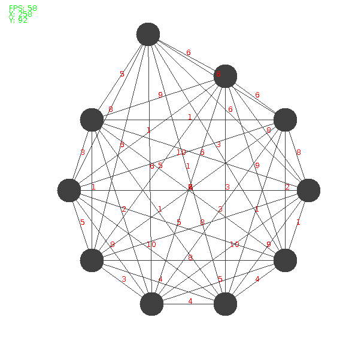

#Visualizing Graphs:
## _Graphs and Concepts From MTH 325_
This is a simple program that can display interactive graphs. I'm hoping to add more and more 
features, as time goes on, that reflect different concepts covered in my MTH 325 course at 
GVSU. I'd also like to be able to add, edit, and delete graphs from the display through an 
interface.  

######_Below is a screenshot of the current interface, each vertex can be moved and readjusted..._
